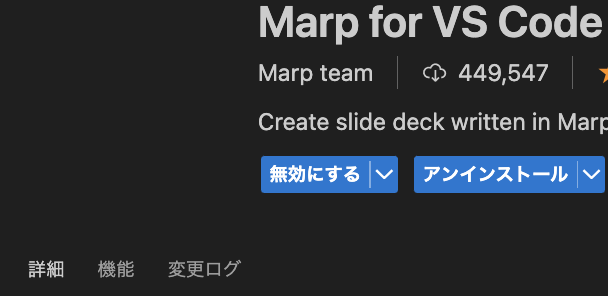
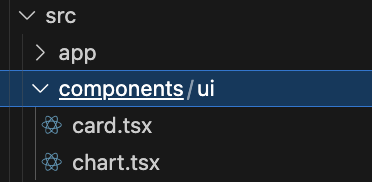
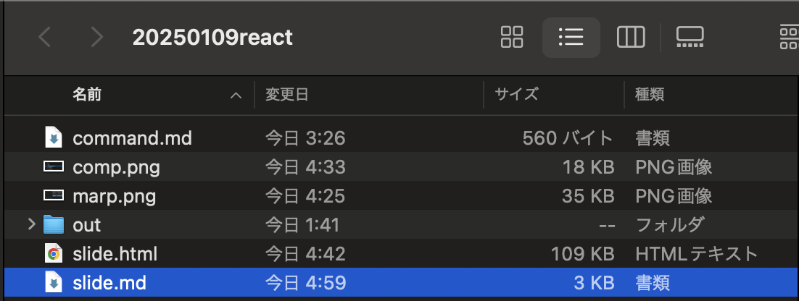

# Marp × Next.js(shadcn/ui)で

# インタラクティブなグラフをプレゼンで使いたい

## nk(えぬけー)

---

# 自己紹介

## nk(えぬけー)

## X(旧:Twitter):@NkEnuke

## 製造業にて DX 業務・アプリ開発に従事(Python,PowerBI,SQL 等)

## 趣味で React を用いてツール作成している

---

# 目的

## プレゼン中に操作できるグラフをスライドに埋め込みたい!

---

# BI ツールを使用しない理由

## ①PC が Mac なので PowerBI は使用できない。

## ②Tableau public では Viz(グラフ有りのダッシュボード)を公開する必要がある。

## ③ 既存の BI ツールだと挙動が重かったりする。

## ※Looker に関しては要検証

---

# 成果物

<iframe 
  src="http://localhost:3000" 
  width="800" 
  height="600" 
  style="border: none;"
>
</iframe>

---

# 導入手順

<pre class="mermaid">
graph LR
  A[MarpをVSCodeに] --> B[Next.js:グラフ作成]
  B --> B2[ビルドしてoutフォルダ出力]
  B2 --> C[outフォルダ + スライド]
  C --> D[localhost 立ち上げ]
  D --> E[Marp ← localhostリンク]
</pre>

<!-- Mermaidを読み込み -->
<script type="module">
import mermaid from 'https://cdn.jsdelivr.net/npm/mermaid@11.4.1/dist/mermaid.esm.min.mjs';
mermaid.initialize({ startOnLoad: true });
</script>

---

# Marp を VSCode に

## npm install -g @marp-team/marp-cli



---

# Next.js:グラフ作成:各種インストール

### yarn create next-app slide //next.js 導入

### npx shadcn@latest init //shadcn/ui 導入

### sudo npx shadcn@latest add chart //shadcn/ui の chart 導入

---

# Next.js:グラフ作成:shadcn/ui がコンポーネント内に



他の UI ライブラリの導入方法とはちょっと違う...(React でも可?)

---

# Next.js:グラフ作成

## 棒グラフ部分のみ抜粋

```
<BarChart data={data}>  　　　　　　　　　　　//ボタンで切り替わるどちらかのデータを取得
<CartesianGrid strokeDasharray="3 3" />   //グラフの背景線を破線にしている
<XAxis dataKey="day" />　　　　　　　　　　　 //横軸に日付データを設定
<YAxis />
<ChartTooltip content={<ChartTooltipContent />} />　//ホバーした時ツールチップを出す:デフォルト
<ChartLegend content={<ChartLegendContent />} />    //凡例表示:デフォルト
<Bar dataKey="value" fill="#82ca9d" />    //棒グラフのデータを値に設定 fillは棒グラフの色
</BarChart>
```

---

# ビルドして out フォルダ出力

next.config.ts に output: "export"を指定

```
import type { NextConfig } from "next";

const nextConfig: NextConfig = {
  /* config options here */
  output: "export",
};

export default nextConfig;

```

npm run build

---

# out フォルダ + スライド

## プレゼン用のスライド(slide.md)と同じフォルダ内にビルドした out フォルダをコピーしてくる



---

# localhost 立ち上げ

## npm install -g serve //ローカルホストを立ち上げられるようにするためインストール

## serve out → ローカルホスト起動

---

# Marp ← localhost リンク

## Marp の md(マークダウン形式)にローカルホストのリンクを iframe で埋め込む。

```
<iframe
  src="https://nkwork9999.github.io/next_charts/"
  width="800"
  height="600"
  style="border: none;"
>
</iframe>
```

---

## プレゼン用のスライド(html)を出力する

npx @marp-team/marp-cli slide.md --html --template bespoke -o slide.html

①npx @marp-team/marp-cli

Marp CLI の実行部分実行します。

②slide.md

スライド用 html ファイルにしたい Markdown ファイルのパス。
この中に書いたスライド用の Markdown から Marp がスライドを生成します。

③--html

出力形式を HTML にします。
ほかにも pdf や powerpoint にも出力できるらしい。

④--template bespoke

Bespoke は Marp のスライドテンプレート
画面クリックや矢印キーなどでページを移動できるように

⑤-o slide.html

## 出力ファイル名の指定。ここでは slide.html という名前で生成されます。

# 実行後、同じディレクトリに slide.html が作成されるので開けばスライドが!🙌

---

# まとめ

---

# ここまでやるか...?(複雑なダッシュボードだとグラフ作成部分で Next.js をデータに合わせてその都度書かないといけない)

# ただ視覚効果もよく、挙動も軽い。ローカルのみで動く。

# Marp に iframe で埋め込む部分は他の用途でも有用かもしれない。
