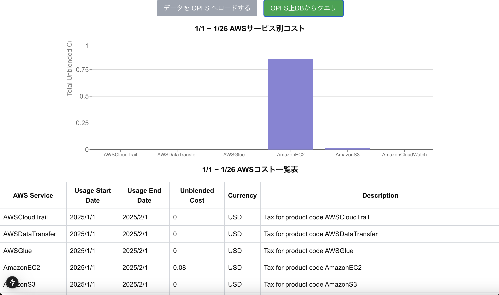

# 2025 年にやりたいこと・学びたい技術

## nk(えぬけー)

---

# 自己紹介

## nk(えぬけー)

## X(旧:Twitter):@NkEnuke

## 製造業にて DX 業務・アプリ開発に従事(Python,PowerBI,SQL 等)

#### 最近は Snowflake や Tableau について勉強中...

---

# 今年、何をやりたいか?

# 色々な技術を学びたい!...がキリがない

##### AWS・Snowflake・dbt・Fastapi・Next.js・GithubActions・統計・英語・Go・データ基盤・データ可視化・機械学習・基盤技術...

#

#

#

#

#

#

#

---

# → 機能・ツールを自作して LT!

## ひとまず触れる状態にはなる。<br>(キッカケになる)

## LT までに作成するという期限が生まれるのでカンペキでなくても区切りがつく。

## 色々な方からフィードバックが頂けたりも

---

# LT を通して今年使いたい・学びたい技術

#

## ① Marp:マークダウン形式でスライド作成

## ② Duckdb:データ分析に限らず幅広い分野を巻き込めそう

## ③ 基盤技術:データベース、ネットワーク...

---

# ①Marp × iframe:プレゼン中にデモ

#### GithubPages 上の静的ページにアクセス

<iframe 
  src="https://nkwork9999.github.io/next_charts/"
  width="800" 
  height="600" 
  style="border: none;"
>
</iframe>

---

# ①Marp × css

#### スライドを css でデザインできる。

```
section::after {
  content: "";
  display: block;
  width: 100%; /* ページ全体に広がる */
  height: 10px;
  position: absolute;
  left: 0;
}

section::after {
  background: linear-gradient(to right, rgb(255, 214, 139) 1%,
  darkorange 99%);
  top: 150px; /* タイトルの下あたりに配置 */
}
```

---

# ②Duckdb × python:SQL で高速データ分析

# 1000 万行 10 列 parquet が 5 秒で!<br>列選択をするとより高速

#

# parquet・iceberg・S3 などからも一行で

#

# .df()を末尾につけると<br>pandas のデータフレームに変換

---

# ②Duckdb × AWS Lambda: S3 データ取得

# Athena より安く S3 に SQL でクエリ

###### [参考(自)記事]

[Duckdb を使用した SQL 操作をする AWS Lambda 関数作成(Python)](https://zenn.dev/amana/articles/7651ec03bb6c3e)

#### 噂では AWS CloudShell からも操作できるらしい...

### [参考記事]

[AWS CloudShell に DuckDB を入れて、ALB のログを見てみた](https://zenn.dev/babyjob/articles/mackey0225-use-duckdb-in-cloudshell)

[AWS CloudShell に DuckDB をインストールして S3 に SQL を投げてみた](https://dev.classmethod.jp/articles/duckdb-s3-sql-from-aws-cloudshell/)

---

# ②Duckdb × Frontend:AWS CUR の可視化

#### Duckdb-wasm でフロントエンド上で S3 をクエリして<br>ブラウザ上の OPFS に db ファイルを作成 → そのデータで可視化

#### CUR データはクエリしても良いように Snowflake でデータ整形済

<!-- <iframe
  src="http://localhost:3000/"
  width="800"
  height="600"
  style="border: none;"
> -->
<!-- </iframe>
 -->


---

# ③ 基盤技術:わからないので作ってさわる

# [すごい人たちの記事・ページ]

[Go でゼロから作る 自作 TCP/IP プロトコル サーバー](https://zenn.dev/kawa1214/books/5888c6b3554ffa)

[Database Design and Implementation を Go で実装した](https://goropikari.hatenablog.com/entry/simpledb_sciore)

[ちいさな Web ブラウザを作ろう](https://browserbook.shift-js.info/chapters/basic-concepts)

#### 緊急性はないが重要なので一年を通して勉強したい

#

#

#

#

---

#

# ご清聴ありがとうございました 🙌
