
何をすれば良いデザインの Viz を 作れそうか調べてみた

---

# 自己紹介

    

                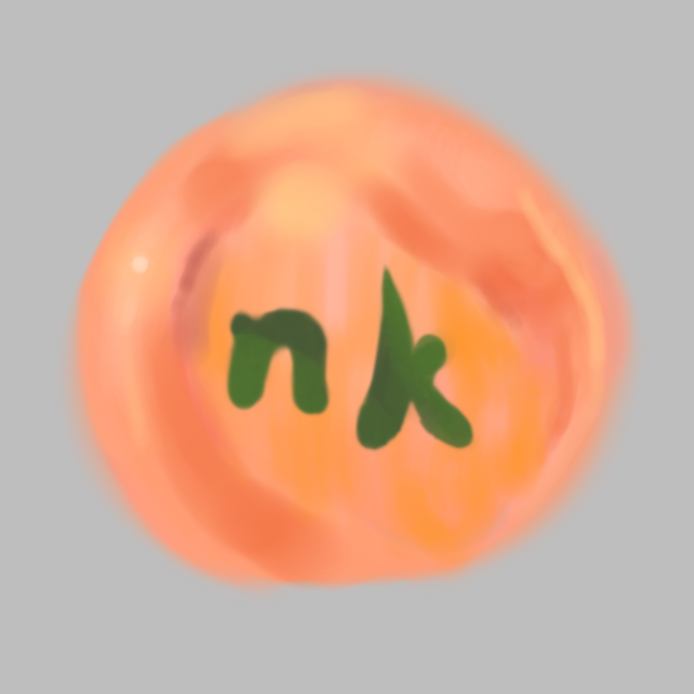
                
nk(えぬけ〜)

            

    <ul>
        <li>業務:データ前処理,データ可視化,アプリケーション作成などなど</li>
        <li>普段はPowerBI→先日なんとかDATASaberになれました。</li>
    </ul>

---

<h1>DATASaber になった!🙌</h1>

... ... ... ... ... ... ...
<h4>でもかっこいい Viz つくれないな...?</h4>

---

# 🤔

<ul>
<li>これまで作ってきた Viz...デフォルトの機能しか使ってない</li>
<li>対して Tableau Public にあるのはとてもデフォルトの機能で 作ったものとは思えない...</li>
<li>どうやったら良いデザインの Viz を作れそうか"初めて" 調べてみた 🔨</li>
</ul>

---

# 1.Figma で公開されているテンプレートを使う

  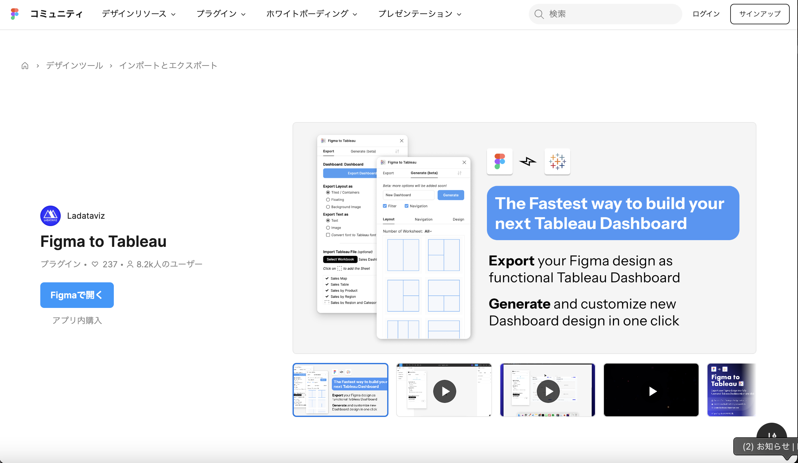

---

# Web アプリのデザインのように編集 → Export

  
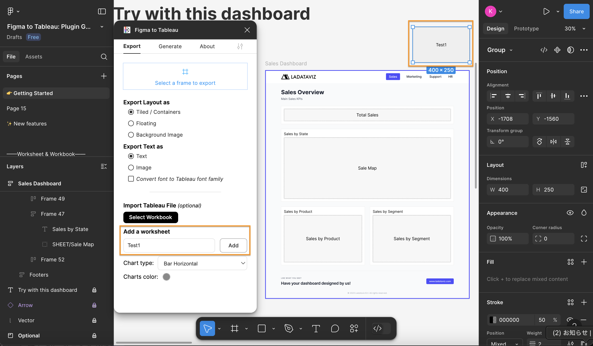

  
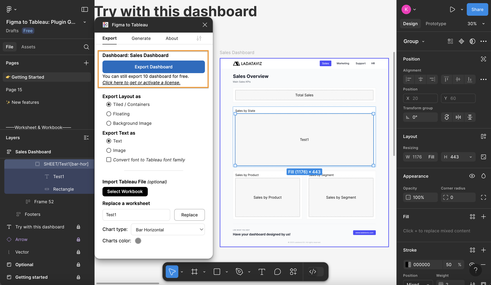

---

# テンプレート通りの Viz が作成

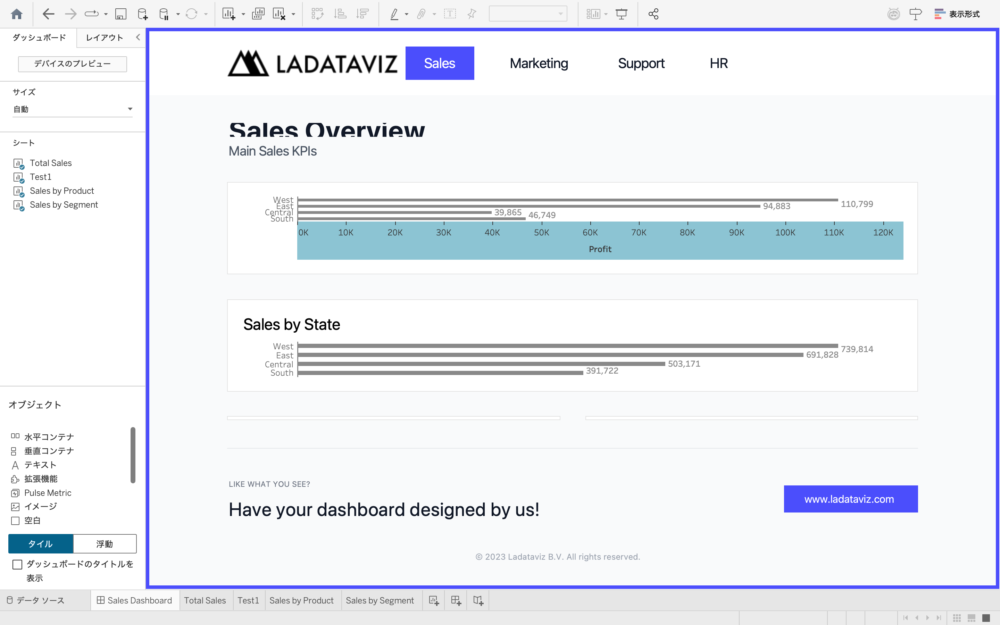
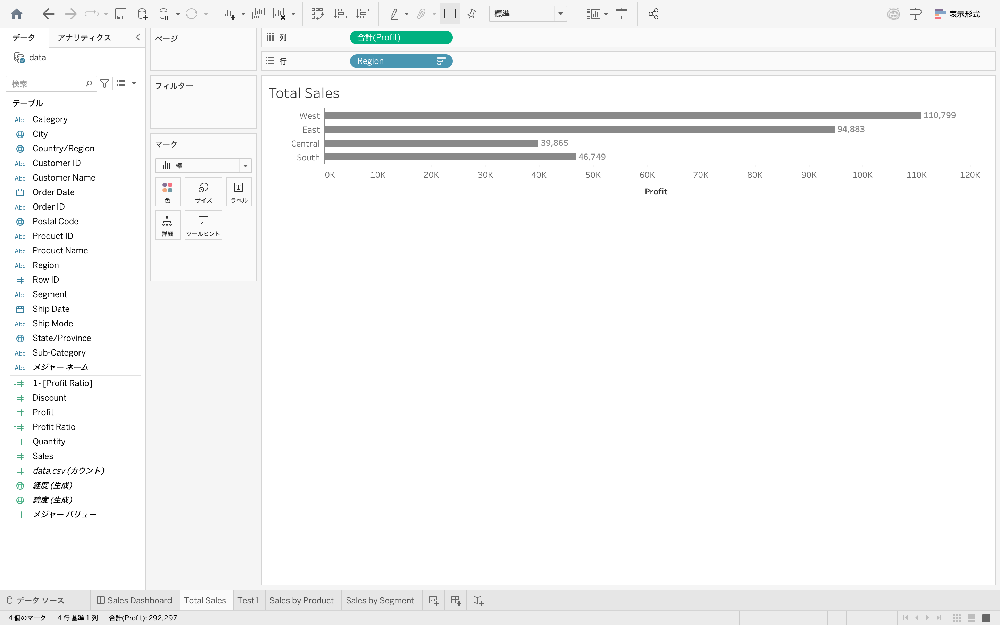

---

# しかし...

<ul>
<li>無料版が 10 回までの Export...
<li>デザイン →Viz となるとデータ探索はしづらい気がする...
<li>今回は断念
</ul>

---

# 2.カスタムテーマを使用する方法

<ul>
<li>Viz 作成はそのまま
<li>書式設定だけ json で作成できる
<li>json を一から書くのは...→ 便利なサイトが!
</ul>

---

# ブラウザ上で色合いを試せるサイトが!

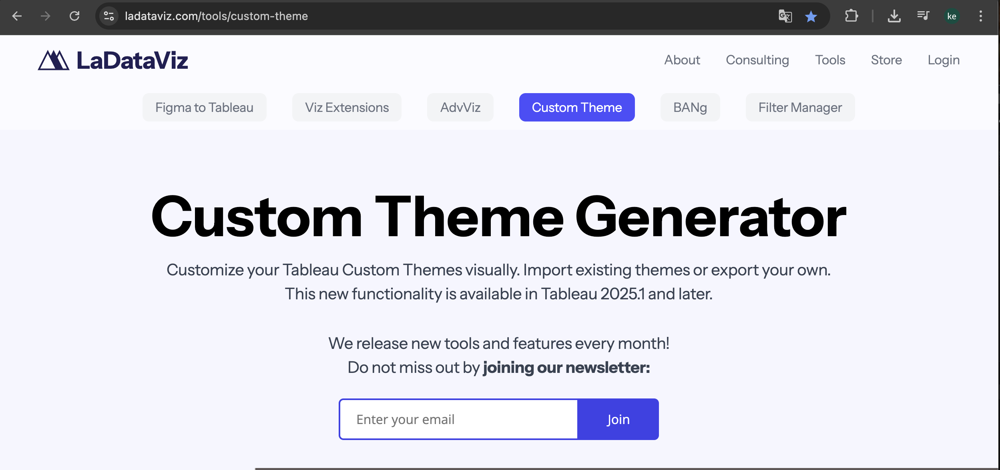

---

# 自由に書式をカスタマイズして json を出力

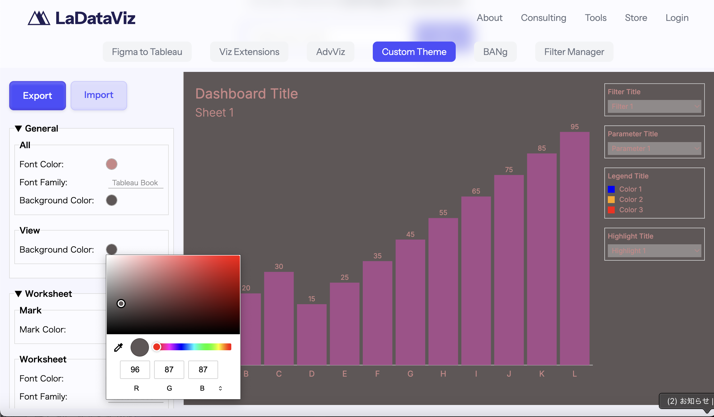
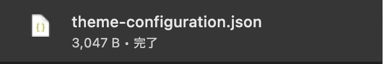

---

# カスタムテーマをインポート!

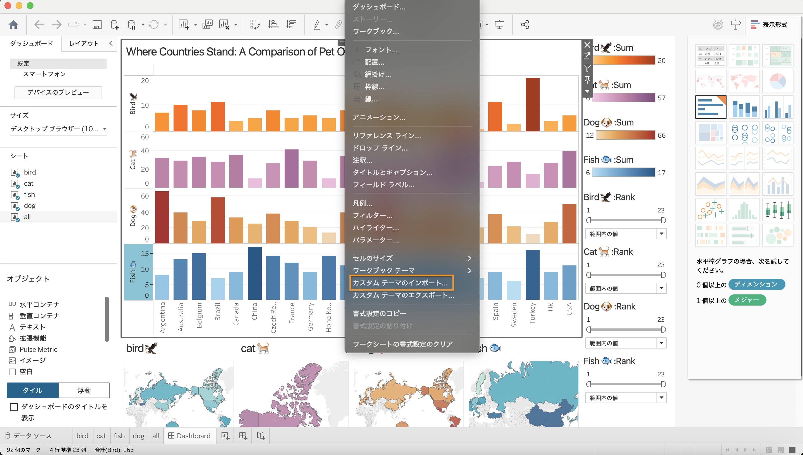
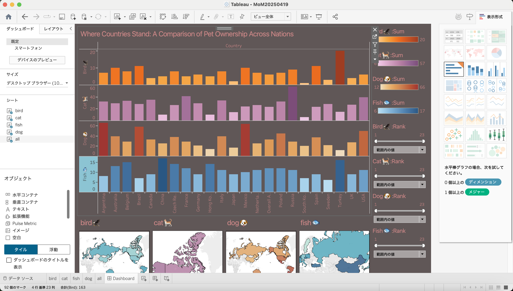

---

# カスタムテーマは手頃に使えそう

<ul>
<li>比較的色々な色合いを手軽に試せる。
<li>Viz のサイズなどは(おそらく)自分で変更
<li>簡易的な用途なら必要十分
</ul>

---

# 番外編:marp に埋め込む

Tableau に Web ページ埋め込み機能が... →html に埋め込もう
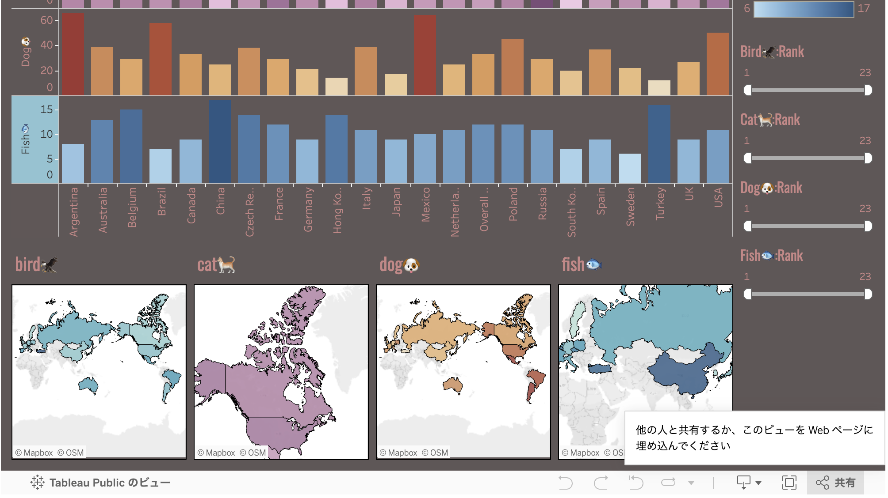

---

# tableau を埋め込んだ html を iframe で marp に

  <iframe src="https://nkwork9999.github.io/-LT-20240423tableau/" width="100%" height="400px"></iframe>

---

# グラスモーフィズムの CSS をあてる

  <iframe src="https://nkwork9999.github.io/-LT-20240423tableau/" width="100%" height="400px"></iframe>

---

# まとめ

<ul>
<li>簡単に使うなら「カスタムテーマ」
<li>html + css を使える状況なら埋め込みもあり? そういう状況が果たしてあるか...
<li>もっと自由に CSS とかあてられたらな...
</ul>

